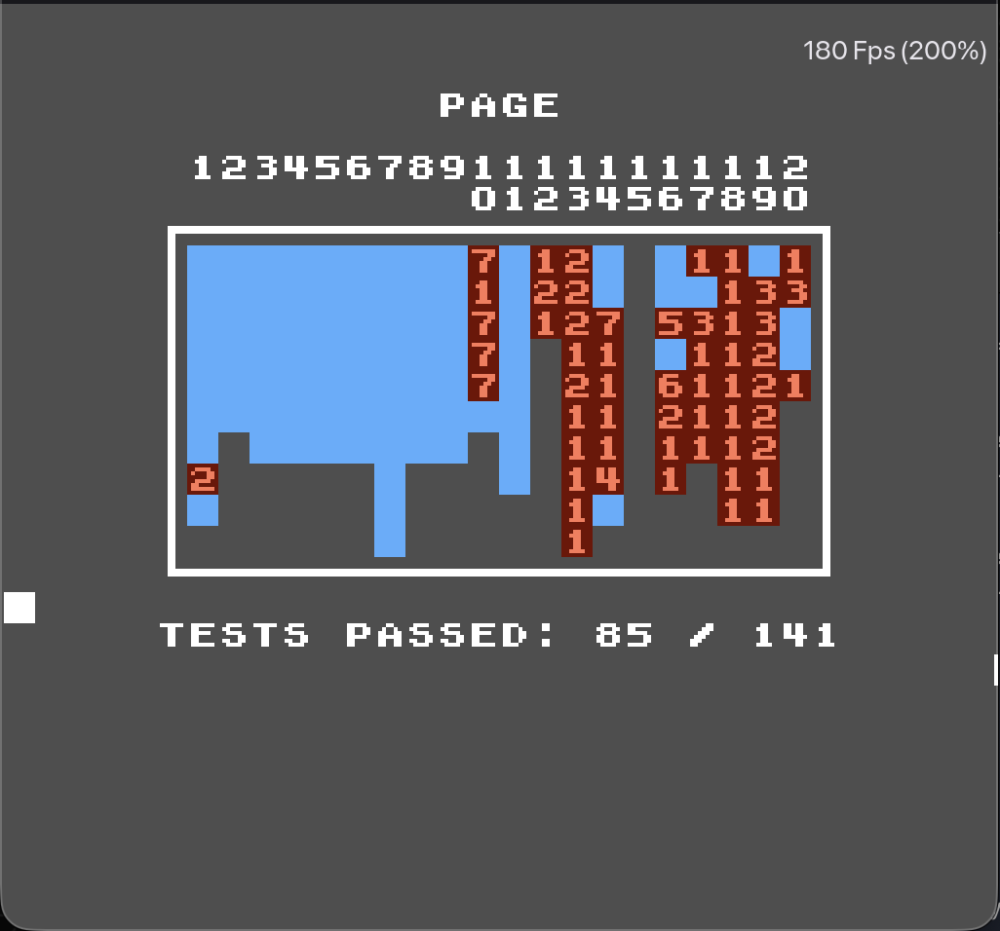

# EXNES

Exnes is a multi-release NES emulation with a focus on balancing cross system performance with accuracy to the hardware. 

## Trying it

### Web build

The web build is currently hosted [here]()

## Native builds

Executables for Windows, Mac and Linux are available on the releases page. 

### Linux 

Release for linux happens through AppImages, the source code for these are present inside build/AppImage.sh, this is there to ensure smooth experience while setting up on linux without needing to manually resolve dependcies or using a package manager. Stable AppImages can found in the releases page

### Running it locally 

### Web build 

There are 2 methods of running the web build depending on the purpose, 

#### Production 

The root includes a dockerfile and Caddyfile, these can be used as it is to run wherever docker is supported.

The port is hardcoded and can only be changed by editing *Caddyfile with no support for env variables currently.

#### Development 

For easy development testing and iteration, a server is included with:

1) File path watching for auto re-compile of wasm binary 
2) Brotli compression with inbuilt in-memory cache 
3) Creation of requisite lists for frontend consumption 

To use the server navigate to cmd/wasm/server and run the binary provided, it defaults to port 8070 

#### Misc

The other 2 builds present in cmd/wasm are for internal testing and may or may not work depending on the commit, so uh I'm not providing any documentation for it but that might change in the future if I make it stable.

### Features

| Feature | Native build | Web build |
|---|---| --- | 
| Speed Adjustment | ✅ |  ✅ | 
| Audio | ✅ |  ✅ | 
| Cheats | ✅ |  ❌ | 
| RAM memory |  ✅ |   | 
| Rom Support | Custom |  Included | 

## Technical details 

### Emulator Core 

Present in ./CORE it contains all the neccesary functions and helpers responsible for emulating the NES Console.

It includes a cycle accurate 6502 rioch cpu with full opcode coverage including all illegal and unstable opcodes. It also includes cycle accurate RDY and DMA capablities with mid instruction blocking. 

NOTE: The cooked branch includes a sub cycle accurate RDY pin behaviour but it is currently unstable and cant be used freely without risk of crash. 

It also includes a dot accurate PPU working based on the og nes fetcher model stimulating all dummy reads and writes present in the dot, this is in conjuction with a dynamically swappable pallete engine with supports both single and full palettes.

The Apu is a standard 5 channel audio engine based on the global clock. 

The core has been built to maximize the accuracy while refraining from entering subcycle (or more) accurate behaviour to mitigate performance issues. This means it accurately stimulates a large amount of quirks and edge cases present in the orignal console. As per the latest release the emulator core scores 86 in the AccuracyCoin which puts it ahead of many commercial and nintendo made emulators for the NES.

One thing to note is that the Core does not expose any timing mechanism on its own nor does it enforce any, consumption of the core needs to come with its own timing mechanism, it is recommend to either sync using runFrame at around 60fps or use the audio sample starvation for frame perfect emulation.

The core also included a cheat engine which supports game genie codes along with support for raw memory patches in the format of addr:val.

Also bundled in is a headerless No-Intro dataset for indentification of games, this information is used for generating accurate saves and it also connects with the cheat engine to provide all known cheats for a game through a easily querable function.

The documentation for how to use the core is scarce and not very intuituive, hence the best way to utilize it right now is looking at cmd/wasm and cmd/sdl for sample code. 

### Web build 

The web build serves the emulator core using web assembly, due to the single threaded nature of javascript runtime in browsers multiple threads with atomic messages run in parralel. 

These are the following:

1) Go web worker: Residing in emuWorker.js this thread owns the go runtime and runs the emulator itself, it spends most of time blocking on frame signals and can only be communicated using shared Array buffers.

2) Audio worklet: runs the audio worklet process, it is also responsible for driving the emulator thread when in audio synced mode. 

3) Main thread: It handles all the other processes including handling button inputs, cross thread communication and animations.

### Native build

The native build runs cross platform by utilizing the sdl library, it includes no dependencies apart from sdl including a layout engine. This means that every window contains its own discrete layout engine and state manager, a lot of this values are hardcoded for ease of development and thus extensions should be carefully made.

It is technically supposed to work on every platform due to the cross platform nature of golang and sdl, but its only been tested on macOs. Please report any issues on other platforms.

