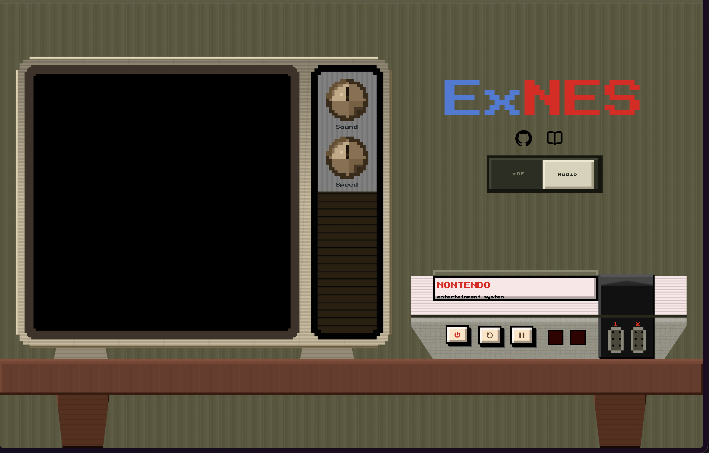
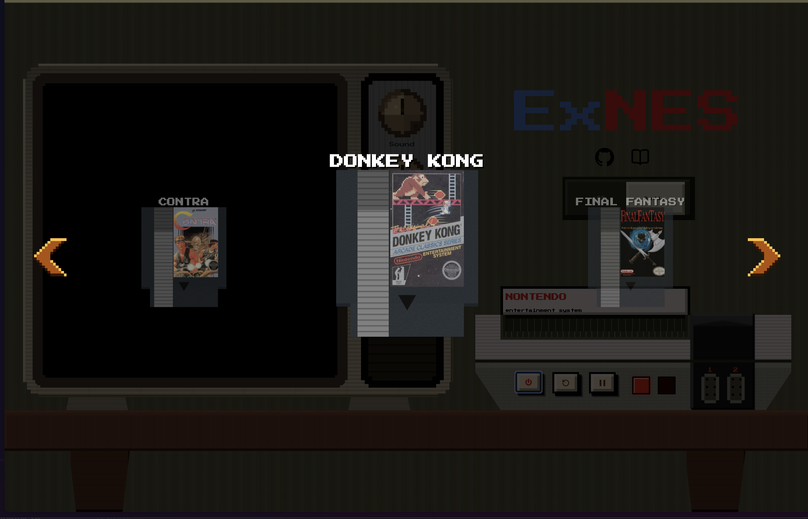
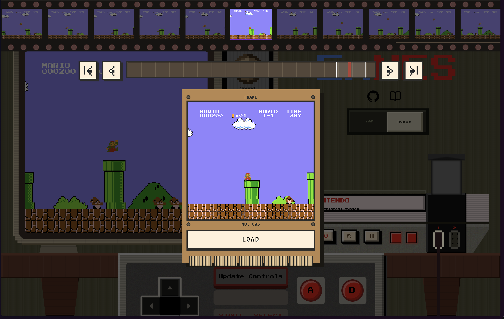
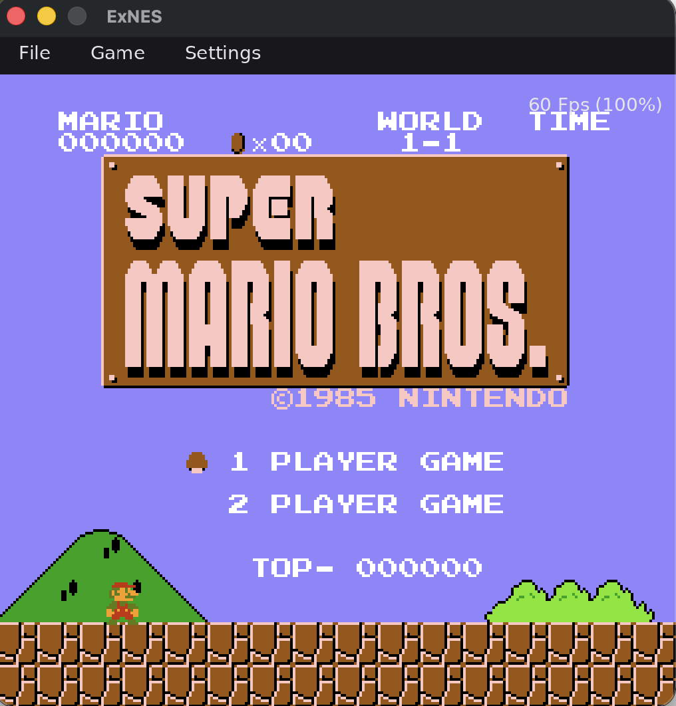
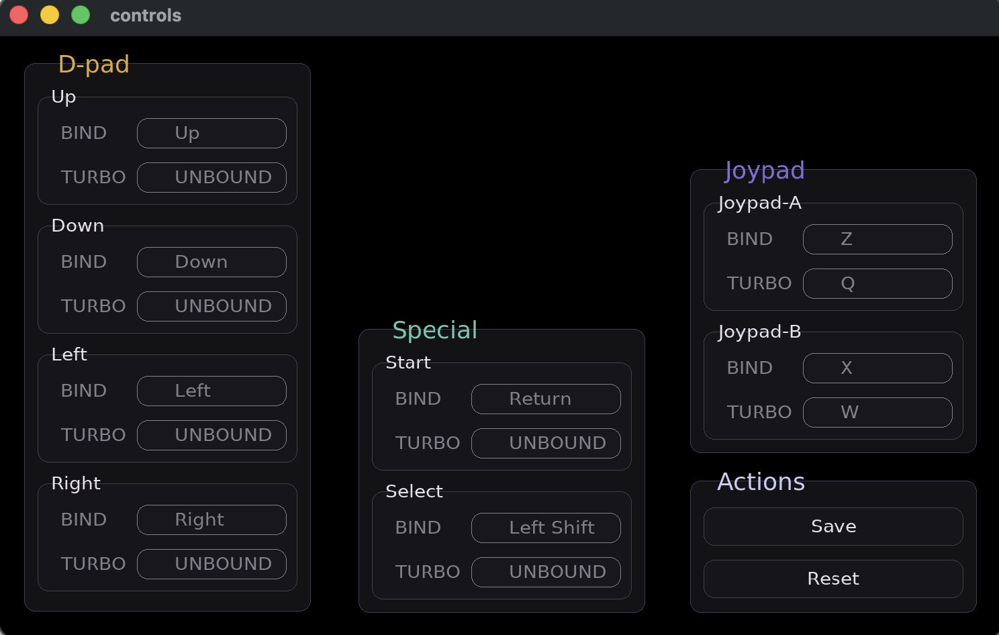
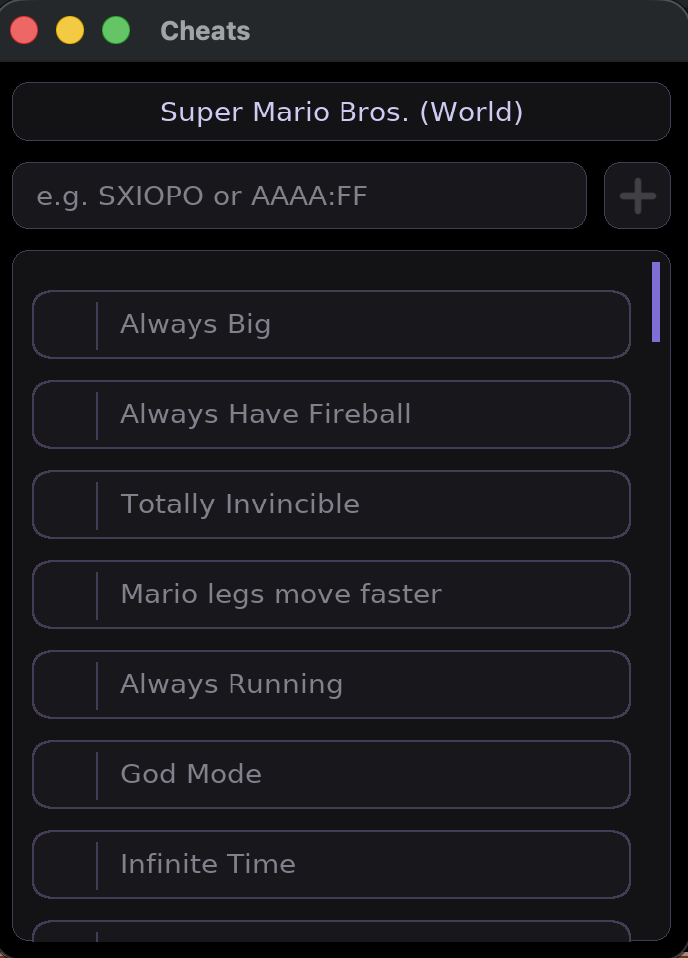

# EXNES

A cycle accurate emulator for the Nintendo Entertainment System written in go, built for performance and compatiblity

The core offers a standalone package without any external dependencies and no timing, rendering or audio management preferences. Allowing for extensive compatiblity and ease of use. 

This repo ships with a sdl frontend for native applications and a web build that runs straight in the browser using web assembly. 

## Playing it 

### Web 

<p align="center">
  
   
    
</p>

The web build runs in any browser with support for shared memory array buffers (most major modern browsers). It is currently only playable on desktop browsers however. A curated set of roms is available built in however support for custom roms is not present. 

> **Hosted at:** https://exnes.a.shipwrights.dev/


## Native builds

<p align="center">
  
   
    
</p>

Executables for Windows, Mac and Linux are available on the releases page. 

### Linux 

Release for linux happens through AppImages, there are no prerequisite dependencies or package manager involved. Stable AppImages can found in the releases page.

```
chmod +x ExNES-x86_64.AppImage
./ExNES-x86_64.AppImage
```
The appImage was built against `Debian 12(glic 2.36)` and hence will not work on older legacy systems, these including distributions like Ubuntu 22.04 and RHEL 8. On these systems build from source instead, a list of needed dependencies can be found in ` AppImage.sh `

### Mac 

MacOS version ships as a `.dmg` for both silicon based and intel based Macs. Due to the unsigned nature of the binary (it costs an arm and leg), the first run will require to explicity allow execution by going to `Settings > Privacy`.

> Dragging and Dropping files on the macOS edition will cause the emulator to crash, this is a known issue with no fix currently.

### Windows

Every release ships two options.

**Portable zip.** Download `ExNES-windows-x86_64.zip`, unpack it anywhere, and run
`exnes.exe`. Nothing is installed and nothing is written outside the app's own
config directory.

**Installer.** Download `ExNES-<version>-windows-x64-setup.exe` and run it. It
installs per-user by default, so Windows never prompts for admin rights, and it
adds Start Menu and optional desktop shortcuts.

Both are self-contained, SDL2 and everything else is bundled alongside the exe,
so there is no runtime to install and no package manager involved. 

The installer additionally registers `.nes` as a file type, which lets you launch
a ROM by double-clicking it, via right-click → Open With, or by dropping it onto
the ExNES icon.

> Neither download is code-signed yet, so SmartScreen will show a
> "Windows protected your PC" warning on first run. Click **More info** →
> **Run anyway**.
### Controls 

The default mappings are common across the native builds and are as follows: 

 
| NES button | Key | Turbo |
|---|---|---|
| D-pad | Arrow keys | — |
| A | `Z` | `Q` |
| B | `X` | `W` |
| Start | `Enter` | — |
| Select | `Left Shift` | — |

The default mappings can be changed by going to `Settings > Input`

Turbo buttons act like turbo buttons on the pro nes controllers and spam a given input while they are held.

### Whats included 

The desktop build comes with a sdl based application window with a lightweight custom made graphics and state handler. 

- Loading rom files from memory with recent files support 
- 10 Save states linked to ROM's hash 
- Battery backed ram support for included Mappers 
- Support for emulation control: Pause,Unpause,Reset,Power Cycle,etc
- Cheat suport in both memory and code format
- Hash based database support linked to cheats menu 
- Support for variable emualtion speed upto 3x
- Volume and fps control 
- Support for dynamic pallete changes
- Customizable controls 
- Turbo controls 
- File associations for os-dependent context menus 

All settings and battery backed ram saves are persistent and stored in: 

| Platform | Path |
|---|---|
| Linux | `~/.config/exnes` |
| macOS | `~/Library/Application Support/exnes` |
| Windows | `%AppData%\exnes` |


## Running it locally 

### Building from Source

Requires Go 1.24+, cgo, and SDL2 development headers.

> Installing depts:

```sh
# Debian / Ubuntu
sudo apt install libsdl2-dev libsdl2-ttf-dev libsdl2-image-dev libsdl2-gfx-dev
 
# macOS
brew install sdl2 sdl2_ttf sdl2_image sdl2_gfx
 
# MSYS2 (MINGW64 shell)
pacman -S mingw-w64-x86_64-toolchain mingw-w64-x86_64-SDL2 \
          mingw-w64-x86_64-SDL2_ttf mingw-w64-x86_64-SDL2_image \
          mingw-w64-x86_64-SDL2_gfx
```

> Building Binary 

```sh
go build -o exnes ./cmd/sdl
./exnes
```

### Using Release artifacts 

`.github/workflows/build.yml` builds all 4 dispatches on every github release, or on a manual action. 

For producing them locally: 

| Target | Command | Output |
|---|---|---|
| Linux  | `docker build -t exnes-build build/` then `build/AppImage.sh` | `dist/*.AppImage` |
| macOS `.dmg` | `bash build/macos.sh` | `dist/*.dmg` |
| Windows `.zip` | `bash build/windows.sh` (MSYS2 MINGW64) | `dist/*.zip` |
| Windows installer | `iscc /DAppVersion=1.0.0 build\installer.iss` | `dist/*-setup.exe` | 

### Running web build 

**Production:** The repository root has a `dockerfile` and `Caddyfile` that work as-is anywhere Docker runs:

```sh 
docker build -t exnes-web 
docker run -p 6000:80 exnes-web
```

The port can be manually changed in the `Caddyfile` but it currently lacks env variable support.

**Development:** `cmd/wasm/server` is a custom built development server specifically made for this project, by default it comes with automatic Wasm recompilation and bundling, brotli compression backed by an in memory cache, and generation support for files used by frontend. 

The default port is set to 8070

```sh
go run ./cmd/wasm/server
```

### Features

| Feature | Native build | Web build |
|---|---| --- | 
| Speed Adjustment | ✅ |  ✅ | 
| Audio | ✅ |  ✅ | 
| Cheats | ✅ |  ❌ | 
| RAM memory |  ✅ |   | 
| Rom Support | Custom |  Included | 


## Repository Map 

```
Core\           # Contains NES Core package 
Cmd\            # Entrypoints
    Sdl\            # Native frontend wtih sdl2
    Wasm\           # Web assembly build + Dev Server and bundler
    ssts\           # Test harness for single step tests
Build\          # Build scripts and artifacts
Media\          # Image gallery for readme
```

## Technical details 

### Emulator Core 

Present in ./CORE it contains all the neccesary functions and helpers responsible for emulating the NES Console.

It includes a cycle accurate 6502 Rioch 2A03 cpu with full opcode coverage including all illegal and unstable opcodes. These are tested against [SingleStepTests](https://github.com/SingleStepTests/65x02) `nes6502/v1`. Along with cycle accuracy for opcodes, it also contains cycle accurate state machines for interrupts.

NOTE: The cooked branch includes a sub cycle accurate RDY pin behaviour but it is currently unstable and cant be used freely without risk of crash. 

It also includes a dot accurate PPU working based on the og nes fetcher model stimulating all dummy reads and writes present in the dot, this is in conjuction with a dynamically swappable pallete engine with supports both single and full palettes.

The Apu is a standard 5 channel audio engine based on the global clock. 

The core has been built to maximize the accuracy while refraining from entering subcycle (or more) accurate behaviour to mitigate performance issues. This means it accurately stimulates a large amount of quirks and edge cases present in the orignal console. As per the latest release the emulator core scores 86 in the AccuracyCoin which puts it ahead of many commercial and nintendo made emulators for the NES.


One thing to note is that the Core does not expose any timing mechanism on its own nor does it enforce any, consumption of the core needs to come with its own timing mechanism, it is recommend to either sync using runFrame at around 60fps or use the audio sample starvation for frame perfect emulation.

The core also included a cheat engine which supports game genie codes along with support for raw memory patches in the format of addr:val.

Also bundled in is a headerless No-Intro dataset for indentification of games, this information is used for generating accurate saves and it also connects with the cheat engine to provide all known cheats for a game through a easily querable function.

The documentation for how to use the core is scarce and not very intuituive, hence the best way to utilize it right now is looking at cmd/wasm and cmd/sdl for sample code. 


### Web build 

The web build serves the emulator core using web assembly, due to the single threaded nature of javascript runtime in browsers multiple threads with atomic messages run in parralel. 

These are the following:

1) Go web worker: Residing in emuWorker.js this thread owns the go runtime and runs the emulator itself, it spends most of time blocking on frame signals and can only be communicated using shared Array buffers.

2) Audio worklet: runs the audio worklet process, it is also responsible for driving the emulator thread when in audio synced mode. 

3) Main thread: It handles all the other processes including handling button inputs, cross thread communication and animations.


### Native build

The native build runs cross platform by utilizing the sdl library, it includes no dependencies apart from sdl including a layout engine. This means that every window contains its own discrete layout engine and state manager, a lot of this values are hardcoded for ease of development and thus extensions should be carefully made.

It is technically supposed to work on every platform due to the cross platform nature of golang and sdl, but its only been tested on macOs. Please report any issues on other platforms.

## Contributions 

Issues and pull requests are welcome. Platform reports are especially useful, the desktop build is tested mainly on macOS, so Linux and Windows regressions tend to be found by users rather than by CI.

